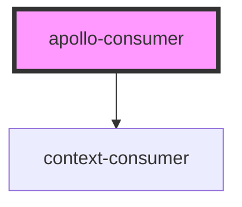

# apollo-consumer

<!-- Auto Generated Below -->

## Properties

| Property   | Attribute | Description | Type                                                  | Default     |
| ---------- | --------- | ----------- | ----------------------------------------------------- | ----------- |
| `client`   | --        |             | `ApolloClient<any>`                                   | `undefined` |
| `renderer` | --        |             | `(client: ApolloClient<any>) => Element \| Element[]` | `undefined` |

## Dependencies

### Depends on

- context-consumer

### Graph

----------------------------------------------

*Built with [StencilJS](https://stenciljs.com/)*
