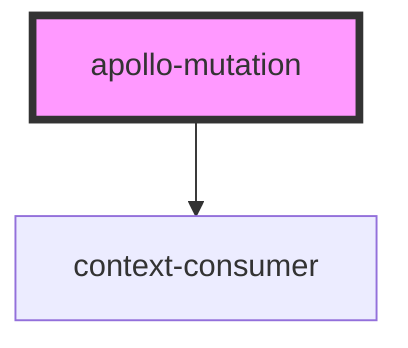

# apollo-mutation

<!-- Auto Generated Below -->

## Properties

| Property    | Attribute   | Description | Type                                                                       | Default     |
| ----------- | ----------- | ----------- | -------------------------------------------------------------------------- | ----------- |
| `client`    | --          |             | `ApolloClient<any>`                                                        | `undefined` |
| `mutation`  | `mutation`  |             | `any`                                                                      | `undefined` |
| `options`   | --          |             | `MutationOptions<{ [key: string]: any; }, OperationVariables>`             | `undefined` |
| `renderer`  | --          |             | `(mutationFn: MutationFn<{}, OperationVariables>) => Element \| Element[]` | `undefined` |
| `variables` | `variables` |             | `any`                                                                      | `undefined` |

## Events

| Event   | Description | Type                                                                         |
| ------- | ----------- | ---------------------------------------------------------------------------- |
| `ready` |             | `CustomEvent<(options: Partial<MutationOptions<any, any>>) => Promise<any>>` |

## Dependencies

### Depends on

- context-consumer

### Graph

----------------------------------------------

*Built with [StencilJS](https://stenciljs.com/)*
