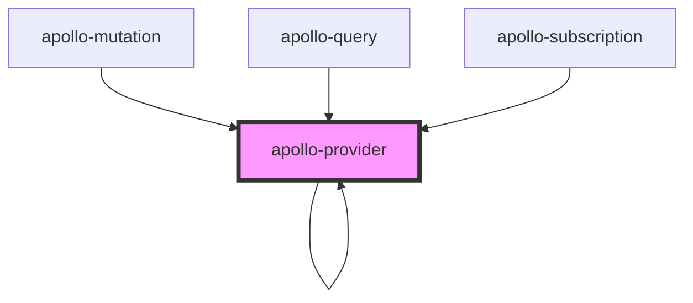

# apollo-provider

<!-- Auto Generated Below -->

## Properties

| Property | Attribute | Description | Type                | Default     |
| -------- | --------- | ----------- | ------------------- | ----------- |
| `client` | --        |             | `ApolloClient<any>` | `undefined` |

## Dependencies

### Used by

 - [apollo-mutation](../apollo-mutation)
 - [apollo-provider]()
 - [apollo-query](../apollo-query)
 - [apollo-subscription](../apollo-subscription)

### Depends on

- context-consumer
- [apollo-provider]()

### Graph

----------------------------------------------

*Built with [StencilJS](https://stenciljs.com/)*
