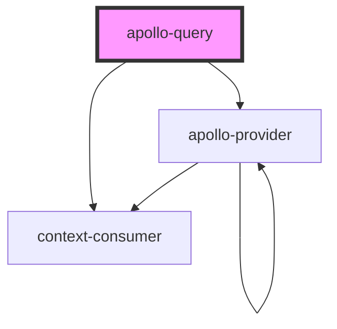

# apollo-query

<!-- Auto Generated Below -->

## Properties

| Property    | Attribute   | Description | Type                                                                     | Default     |
| ----------- | ----------- | ----------- | ------------------------------------------------------------------------ | ----------- |
| `client`    | --          |             | `ApolloClient<any>`                                                      | `undefined` |
| `options`   | --          |             | `WatchQueryOptions<OperationVariables>`                                  | `undefined` |
| `query`     | --          |             | `DocumentNode`                                                           | `undefined` |
| `renderer`  | --          |             | `(result: QueryResult<any, OperationVariables>) => Element \| Element[]` | `undefined` |
| `variables` | `variables` |             | `any`                                                                    | `undefined` |

## Events

| Event    | Description | Type                                                                                                                                                                                                                                                                                                                                                                                                                                                                                                                                                                                                                                                                    |
| -------- | ----------- | ----------------------------------------------------------------------------------------------------------------------------------------------------------------------------------------------------------------------------------------------------------------------------------------------------------------------------------------------------------------------------------------------------------------------------------------------------------------------------------------------------------------------------------------------------------------------------------------------------------------------------------------------------------------------- |
| `ready`  |             | `CustomEvent<{ data: any; loading: boolean; error: ApolloError; variables: OperationVariables; networkStatus: NetworkStatus; refetch: (variables?: OperationVariables) => Promise<void>; fetchMore: (fetchMoreOptions: { query?: DocumentNode; variables?: OperationVariables; updateQuery: Function; }) => Promise<void>; startPolling: (interval: number) => void; stopPolling: () => void; subscribeToMore: (options: { document: DocumentNode; variables?: OperationVariables; updateQuery?: Function; onError?: Function; }) => () => void; updateQuery: (previousResult: any, options: { variables: OperationVariables; }) => any; client: ApolloClient<any>; }>` |
| `result` |             | `CustomEvent<{ data: any; loading: boolean; error: ApolloError; variables: OperationVariables; networkStatus: NetworkStatus; refetch: (variables?: OperationVariables) => Promise<void>; fetchMore: (fetchMoreOptions: { query?: DocumentNode; variables?: OperationVariables; updateQuery: Function; }) => Promise<void>; startPolling: (interval: number) => void; stopPolling: () => void; subscribeToMore: (options: { document: DocumentNode; variables?: OperationVariables; updateQuery?: Function; onError?: Function; }) => () => void; updateQuery: (previousResult: any, options: { variables: OperationVariables; }) => any; client: ApolloClient<any>; }>` |

## Dependencies

### Depends on

- context-consumer
- [apollo-provider](../apollo-provider)

### Graph

----------------------------------------------

*Built with [StencilJS](https://stenciljs.com/)*
