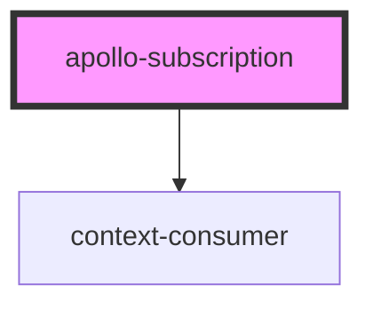

# apollo-subscription

<!-- Auto Generated Below -->

## Properties

| Property       | Attribute   | Description | Type                                            | Default     |
| -------------- | ----------- | ----------- | ----------------------------------------------- | ----------- |
| `client`       | --          |             | `ApolloClient<any>`                             | `undefined` |
| `options`      | --          |             | `SubscriptionOptions<Record<string, any>, any>` | `undefined` |
| `renderer`     | --          |             | `(result: any) => Element \| Element[]`         | `undefined` |
| `subscription` | --          |             | `DocumentNode`                                  | `undefined` |
| `variables`    | `variables` |             | `any`                                           | `undefined` |

## Events

| Event    | Description | Type               |
| -------- | ----------- | ------------------ |
| `ready`  |             | `CustomEvent<any>` |
| `result` |             | `CustomEvent<any>` |

## Dependencies

### Depends on

- context-consumer

### Graph

----------------------------------------------

*Built with [StencilJS](https://stenciljs.com/)*
